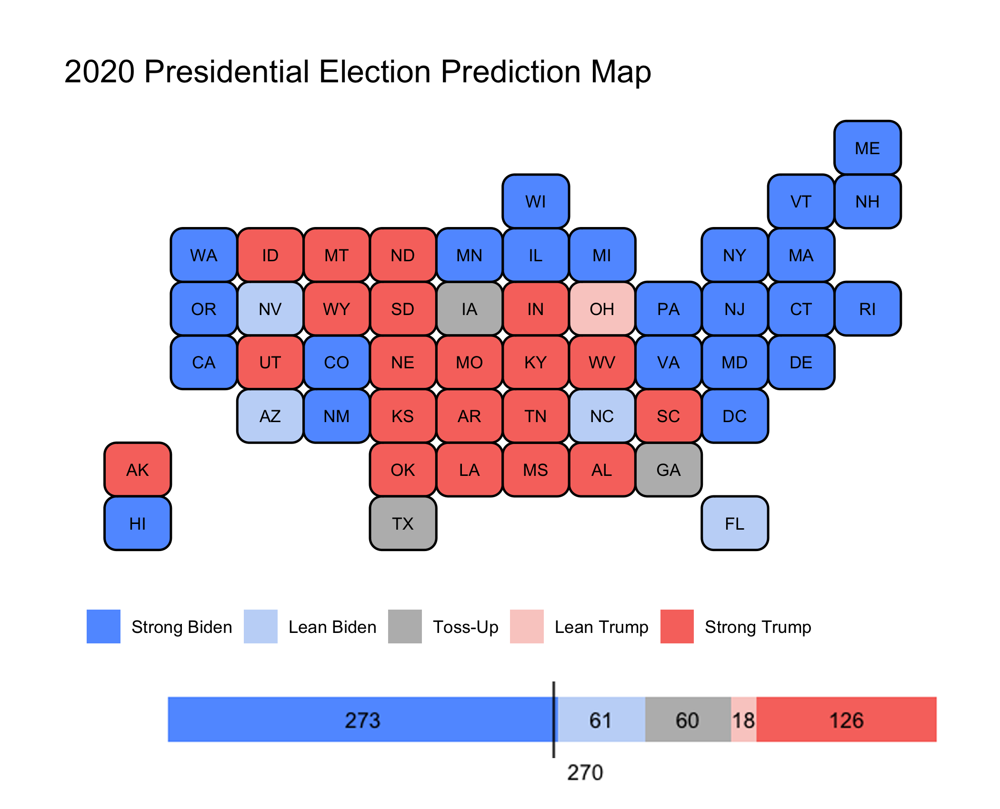

# GOV-1347 Election Analytics

Code, data, and figures used in my GOV 1347 Election Analytics Blog posts for the 2020 Presidential Election.

## Table of Contents

1. [Introduction](https://itsyaoyu.com/blog/gov-1347-introduction/)

2. [The Economy](https://itsyaoyu.com/blog/gov-1347-the-economy/)

3. [Polls](https://itsyaoyu.com/blog/gov-1347-polls/)

4. [Incumbency](https://itsyaoyu.com/blog/gov-1347-incumbency/)

5. [Advertising](https://itsyaoyu.com/blog/gov-1347-advertising/)

6. [Demographics](https://itsyaoyu.com/blog/gov-1347-demographics/)

7. [Shocks](https://itsyaoyu.com/blog/gov-1347-shocks/)

8. [Final Prediction]()
